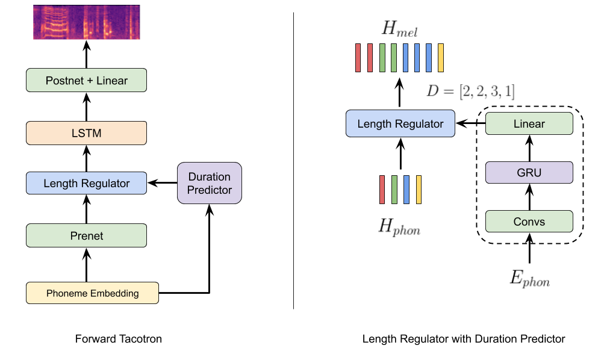

# ⏩ ForwardTacotron

Inspired by Microsoft's [FastSpeech](https://www.microsoft.com/en-us/research/blog/fastspeech-new-text-to-speech-model-improves-on-speed-accuracy-and-controllability/)
we modified Tacotron (Fork from fatchord's [WaveRNN](https://github.com/fatchord/WaveRNN)) to generate speech in a single forward pass using a duration predictor to align text and generated mel spectrograms. Hence, we call the model ForwardTacotron (see Figure 1).

<p align="center">
  
</p>
<p align="center">
  <b>Figure 1:</b> Model Architecture.
</p>

The model has following advantages:
- **Robustness:** No repeats and failed attention modes for challenging sentences.
- **Speed:** The generation of a mel spectogram takes about 0.04s on a GeForce RTX 2080.
- **Controllability:** It is possible to control the speed of the generated utterance.
- **Efficiency:** In contrast to FastSpeech and Tacotron, the model of ForwardTacotron
does not use any attention. Hence, the required memory grows linearly with text size, which makes it possible to synthesize large articles at once.


## UPDATE (29.04.2020)
1. Models now use phonemes, which improves audio quality and reduces pronunciation errors.
2. Training is now running on a train / val split and can be monitored with tensorboard (see example at the bottom).
3. Additional monitoring for WaveRNN that helps to cherry-pick the model.

## 🔈 Samples

[Can be found here.](https://as-ideas.github.io/ForwardTacotron/)

The samples are generated with a model trained 100K steps on LJSpeech together with the pretrained WaveRNN vocoder
provided by the WaveRNN repo. Both models are commited in the pretrained folder. You can try them out with the following notebook:  

[](https://colab.research.google.com/github/as-ideas/ForwardTacotron/blob/master/notebooks/synthesize.ipynb)

## ⚙️ Installation

Make sure you have:

* Python >= 3.6

Install espeak as phonemizer backend (for macOS use brew):
```
sudo apt-get install espeak
```

Then install the rest with pip:
```
pip install -r requirements.txt
```

## 🚀 Training your own Model

(1) Download and preprocess the [LJSpeech](https://keithito.com/LJ-Speech-Dataset/) dataset:
```
python preprocess.py --path /path/to/ljspeech --dataset ljspeech
```
Default to Chinese [databaker 标贝科技中文标准女声](https://www.data-baker.com/open_source.html) dataset, download and uncompress to a folder:
```
python preprocess.py --path /path/to/databaker --dataset databaker
```
(2) Train Tacotron with:
```
python train_tacotron.py
```
(3) Use the trained tacotron model to create alignment features with:
```
python train_tacotron.py --force_align
```
(4) Train ForwardTacotron with:
```
python train_forward.py
```
(5) Generate Sentences with Griffin-Lim vocoder:
```
python gen_forward.py --alpha 1 --input_text "汉字输入转换为 pin1 yin1 和训练数据保持一致" griffinlim
```
As in the original repo you can also use a trained WaveRNN vocoder:
```
python gen_forward.py --input_text "汉字输入转换为 pin1 yin1 和训练数据保持一致" wavernn
```
____

## References

* [FastSpeech: Fast, Robust and Controllable Text to Speech](https://arxiv.org/abs/1905.09263)

## Acknowlegements

* [https://github.com/keithito/tacotron](https://github.com/keithito/tacotron)
* [https://github.com/fatchord/WaveRNN](https://github.com/fatchord/WaveRNN)
* [https://github.com/xcmyz/LightSpeech](https://github.com/xcmyz/LightSpeech)

## Maintainers

* Christian Schäfer, github: [cschaefer26](https://github.com/cschaefer26)

## Copyright

See [LICENSE](LICENSE) for details.
